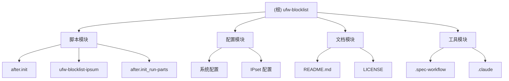

# UFW Blocklist 项目文档

## 变更记录 (Changelog)

**2025-11-27 11:28:25**: 初始化项目文档，创建根级和模块级文档结构。

## 项目愿景

UFW Blocklist 是一个专为 Ubuntu UFW (Uncomplicated Firewall) 设计的 IP 地址阻止列表工具，旨在提供高效、低资源消耗的网络防护能力。该项目通过集成 Linux ipsets 实现内核级别的性能，并自动从 IPsum 获取最新的恶意 IP 地址列表，为系统提供实时的网络威胁防护。

## 架构总览

本项目采用简单而高效的架构，主要由两个核心脚本组成：
- `after.init`: UFW 集成脚本，负责防火墙规则的创建和管理
- `ufw-blocklist-ipsum`: 定时任务脚本，负责从 IPsum 获取最新的 IP 阻止列表

## 模块结构图



## 模块索引

| 模块路径 | 类型 | 职责 | 状态 |
|---------|------|------|------|
| / | 根目录 | 项目根目录，包含核心脚本和文档 | 已扫描 |
| /脚本模块 | 核心脚本 | UFW 集成和 IP 列表管理 | 已扫描 |
| after.init | 主集成脚本 | 直接模式的防火墙规则管理 | 已扫描 |
| after.init_run-parts | 架构扩展框架 | 高级用户的模块化扩展支持（实验性功能） | 已扫描 |
| ufw-blocklist-ipsum | IP 列表脚本 | 定时任务，从 IPsum 获取恶意 IP 列表 | 已扫描 |
| /配置模块 | 配置 | 系统和 IPset 配置管理 | 已扫描 |
| /文档模块 | 文档 | 项目文档和许可证 | 已扫描 |
| /工具模块 | 工具 | 开发和规范工作流工具 | 已扫描 |

## 运行与开发

### 安装要求
- Ubuntu 系统 (支持 Ubuntu 20.04 LTS, 22.04 LTS, 24.04 LTS)
- UFW (Uncomplicated Firewall)
- ipset 包
- curl 工具

### 安装步骤
1. 安装依赖包：`sudo apt install ipset`
2. 备份原始配置：`sudo cp /etc/ufw/after.init /etc/ufw/after.init.orig`
3. 安装脚本文件：
   ```bash
   sudo cp after.init /etc/ufw/after.init
   sudo cp ufw-blocklist-ipsum /etc/cron.daily/ufw-blocklist-ipsum
   sudo chown root:root /etc/ufw/after.init /etc/cron.daily/ufw-blocklist-ipsum
   sudo chmod 750 /etc/ufw/after.init /etc/cron.daily/ufw-blocklist-ipsum
   ```
4. 下载初始 IP 列表并启动服务

### 基本使用
有两种方式使用这个系统：

#### 方式一：直接脚本模式（默认安装方式）
- 启动：`sudo /etc/ufw/after.init start`
- 停止：`sudo /etc/ufw/after.init stop`
- 状态：`sudo /etc/ufw/after.init status`
- 清空：`sudo /etc/ufw/after.init flush-all`

#### 方式二：模块化脚本模式（高级扩展）
`after.init_run-parts` 是为高级用户提供的**架构扩展框架**，用于支持多个阻止列表模块：

**⚠️ 重要说明**：此功能在原始项目的 "Todo" 部分标记为未完成，属于**实验性功能**。

**扩展能力**：
- 支持地理位置阻止（Geo-blocking）
- 支持自定义黑名单列表
- 支持白名单机制
- 支持多个 IP 源（IPsum + 自定义源）

**安装方式**：
```bash
# 替换为模块管理器
sudo cp after.init_run-parts /etc/ufw/after.init

# 创建模块目录
sudo mkdir -p /etc/ufw/after.init.d/

# 安装模块（按数字顺序执行）
sudo cp ufw-blocklist-ipsum /etc/ufw/after.init.d/10-ipblocklist-ipsum.ufw
# sudo cp geo-blocklist /etc/ufw/after.init.d/20-geo-blocklist.ufw
# sudo cp custom-blocklist /etc/ufw/after.init.d/30-custom-blocklist.ufw

# 设置权限
sudo chown root:root /etc/ufw/after.init /etc/ufw/after.init.d/*.ufw
sudo chmod 750 /etc/ufw/after.init /etc/ufw/after.init.d/*.ufw
```

**模块执行**：使用标准命令，模块按数字顺序执行（10→20→30...）。

## 测试策略

- 系统在多个 Ubuntu 版本上经过测试：Armbian 22.05.3、Ubuntu 22.04 LTS、Ubuntu 24.04 LTS
- 使用 IPsum 提供的分级 IP 列表（默认使用 level 3）
- 提供状态监控功能，可查看阻止条目数量和命中计数
- 包含自动更新机制，每日刷新 IP 阻止列表

## 编码规范

- 脚本使用 Bash 编写，遵循 POSIX 标准
- 代码注释清晰，包含版权信息和 GPL v3 许可证声明
- 错误处理完善，包含详细的日志记录
- 安全设计，最小化对存储系统的写入操作

## AI 使用指引

该项目适合运维工程师使用，主要场景包括：
- 网络安全防护
- 恶意 IP 地址阻止
- 防火墙规则管理
- 系统安全监控

## 技术特点

- **高性能**: 使用 Linux ipsets 实现内核级别的 IP 匹配
- **低资源**: 专为资源受限环境（如单板计算机）设计
- **自动化**: 每日自动更新 IP 阻止列表
- **全面防护**: 阻止入站、出站和转发流量
- **监控友好**: 提供详细的状态和日志信息